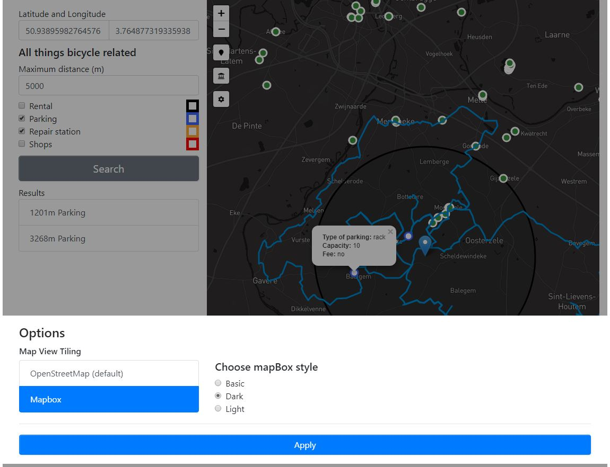

# General course assignment

Build a map-based application, which lets the user see geo-based data on a map and filter/search through it in a meaningfull way. Specify the details and build it in your language of choice. The application should have 3 components:

1. Custom-styled background map, ideally built with [mapbox](http://mapbox.com). Hard-core mode: you can also serve the map tiles yourself using [mapnik](http://mapnik.org/) or similar tool.
2. Local server with [PostGIS](http://postgis.net/) and an API layer that exposes data in a [geojson format](http://geojson.org/).
3. The user-facing application (web, android, ios, your choice..) which calls the API and lets the user see and navigate in the map and shows the geodata. You can (and should) use existing components, such as the Mapbox SDK, or [Leaflet](http://leafletjs.com/).

## Data sources

- [Open Street Maps](https://www.openstreetmap.org/)

## My project

**Application description**: Tweewieler application aims to help encourage cyclists to go and explore their surroundings. User is able to enter his or her location with a click on a map. This action triggers search for bicycle routes near his or her location. Further functionality includes:
<dl>
  <dt>Search all things bicycle related</dt>
  <dd>
    User can search for bicycle rentals, parkings, repair stations and shops. Search is performed in respect to user current location and radius entered.
  </dd>

  <dt>Search for tourist landmarks and attractions</dt>
  <dd>User is able to pick one from Belgium provinces and show all the landmarks it contains. Landmarks showed may be one of these categories: bunker, castle, fort, memorial, monument, ruins, unspecific attraction, binoculars, viewpoint.</dd>
</dl>

**Data source**: `https://download.geofabrik.de/europe/belgium.html`

**Technologies used**: NodeJS, Leaflet, MapBox, PostgreSQL

### Documentation

**Files**:  
`public/js/main.js` - frontend logic, calling backend api and html elements functions are defined in here  
`controllers/api.js` - backend logic and database access as well as query creation is defined here

**Data**:  
`planet_osm_polygon` - We are using this table to get all the provinces in Belgium. Provinces are defined as polygons where column boundary = 'administrative' and column admin_level = '6' as can be found on pages of WikiProject Belgium [Boundaries](https://wiki.openstreetmap.org/wiki/WikiProject_Belgium/Boundaries) There are 10 provinces in Belgium hovewer, there is 33 polygons that represent them. Most of them belongs to Antwerp province in Netherlands.  
`planet_osm_point` - This table is used to search for landmarks, attractions and other bicycle related places. Columns used for filtering are: shop, amenity, historic, tourism and way.  
`planet_osm_line` - This table is used to get bicycle routes in vicinity of the user. Most important column for us is 'route'('bicycle'). We also return column 'surface', that can be used to predict quality of the cycle routes. Unfortunately only 42 out of 11033 routes are denoted by one of the different categories. The rest is null.

All ways column in the database are represented in different SRID than we use in leaflet. Leaflet uses SRID 4326, therefore we always transform these columns before passing them to frontend in GeoJSON format or compare them against each other.

**Database queries**:  
Search nearby bicycle paths example:  
```sql
SELECT
  osm_id AS id,
  route,
  surface,
  name,
  ST_AsGeoJSON(ST_FlipCoordinates(ST_Transform(way, 4326))),
  tags
FROM planet_osm_line
WHERE (route = 'bicycle' AND
       ST_Intersects(ST_Buffer(ST_SetSRID(ST_Point('4.322776794433595', '50.85147463352982'), 4326) :: GEOGRAPHY, 2000),
                     ST_Transform(way, 4326)))
```

Get all things bicycle related example:  
```sql
SELECT
  osm_id                                     AS id,
  amenity,
  shop,
  covered,
  name,
  operator,
  to_json(tags)                              AS tags,
  ST_DistanceSphere(ST_Transform('SRID=4326;POINT(4.322433471679688 50.84410451978967)' :: GEOMETRY, 4326),
                    ST_Transform(way, 4326)) AS st_distance,
  ST_AsGeoJSON(ST_Transform(way, 4326), 7)
FROM planet_osm_point
WHERE (
  ST_DistanceSphere(ST_Transform('SRID=4326;POINT(4.322433471679688 50.84410451978967)' :: GEOMETRY, 4326),
                                      ST_Transform(way, 4326)) < '5000' 
  AND (amenity = 'bicycle_parking' OR shop = 'bicycle')
)
ORDER BY st_distance ASC
```

Search landmarks and attractions per province example:  
```sql
SELECT
  point.osm_id        AS id,
  point.historic,
  point.tourism,
  point.name,
  to_json(point.tags) AS tags,
  ST_AsGeoJSON(ST_Transform(point.way, 4326), 7),
  point.way
FROM (SELECT *
      FROM planet_osm_point
      WHERE (historic IN ('bunker', 'castle', 'fort', 'memorial', 'monument', 'ruins') OR
             tourism IN ('attraction', 'binoculars', 'viewpoint'))) AS point, 
     (SELECT way
      FROM planet_osm_polygon
      WHERE (osm_id = '-53114')) AS province
WHERE (ST_Contains(province.way, point.way))
```

**View options(leaflet/mapbox)**:  
There is an option of changin style of Tiling used in map. This can be changed by clicking on cog controls and selecting the desired one:  
 * OpenStreetMaps
 * MapBox default
 * MapBox dark
 * MapBox light

MapView were created from the Dark and Light template in the mapBox studio respectively. Deviations from the original templates are only minimal. For example water color in Light view was adjusted to be a bit more blue and color of town labels were adjusted from grey to black for better readability. 

Interface for view options can be seen in the image at the end of this README file.

**Creating indices to improve performance**: 

```sql
CREATE INDEX point_amenity
  ON planet_osm_point (amenity);
CREATE INDEX point_shop
  ON planet_osm_point (shop)
  WHERE shop = 'bicycle';
```

```sql
CREATE INDEX polygon_boundary
  ON planet_osm_polygon (boundary)
  WHERE boundary = 'administrative';
CREATE INDEX polygon_admin_leve
  ON planet_osm_polygon (admin_level)
  WHERE admin_level = '6';
```

```sql
CREATE INDEX point_historic
  ON planet_osm_point (historic);
CREATE INDEX point_tourism
  ON planet_osm_point (tourism);
```

```sql
CREATE INDEX lines_route
  ON planet_osm_line (route)
  WHERE route = 'bicycle';
```

Main view                             |  All things bicycle related
:------------------------------------:|:-----------------------------------------------:
   |  

Province preview                    |  Province landmarks and attractions
:----------------------------------:|:-----------------------------------------------:
   |  

Options                    |
:----------------------------------:|
   |
